<div align="center">

<!-- Animated Banner -->
<picture>
  <source media="(prefers-color-scheme: dark)" srcset="assets/banner.svg">
  <source media="(prefers-color-scheme: light)" srcset="assets/banner.svg">
  
</picture>

<br/>
<br/>

<!-- Badges -->
[](LICENSE)
[](https://go.dev/)
[](https://kubernetes.io/)
[](https://reactjs.org/)
[](https://www.typescriptlang.org/)

<br/>

**Open-source Kubernetes-native platform for CI/CD, GitOps, and Cluster Management**

[Documentation](https://docs.krustron.io) · [Report Bug](https://github.com/anubhavg-icpl/krustron/issues) · [Request Feature](https://github.com/anubhavg-icpl/krustron/issues)

</div>

---

## Overview

Krustron is a comprehensive Kubernetes-native platform that unifies cluster management, CI/CD pipelines, GitOps workflows, and observability into a single, powerful dashboard. Built for modern DevOps teams who need to manage multiple clusters at scale.

<div align="center">

| Feature | Description |
|---------|-------------|
| **Multi-Cluster** | Manage 50+ Kubernetes clusters from a single pane of glass |
| **GitOps** | Native ArgoCD integration with auto-sync and self-heal |
| **CI/CD** | Visual pipeline builder with DORA metrics tracking |
| **Security** | Container scanning with Trivy and OPA policy enforcement |
| **Observability** | Integrated metrics, logging, and distributed tracing |

</div>

## Features

<table>
<tr>
<td width="50%">

### Core Platform
- **Unified Dashboard** — Real-time resource browser for Nodes, Pods, Deployments, and CRDs
- **Multi-Cluster Management** — Single control plane for all your clusters
- **Fine-grained RBAC** — Role-based access control with OIDC/SSO integration
- **Real-time WebSocket** — Live updates and streaming logs

</td>
<td width="50%">

### GitOps & CI/CD
- **Visual Pipeline Builder** — Drag-and-drop YAML editor
- **ArgoCD Integration** — Native GitOps with automatic sync
- **Canary & Blue/Green** — Traffic splitting via Istio/Linkerd
- **DORA Metrics** — Deployment frequency, lead time, MTTR

</td>
</tr>
<tr>
<td width="50%">

### Helm Management
- **Repository Management** — Add, sync, and search Helm repos
- **Release Management** — Install, upgrade, rollback releases
- **Drift Detection** — Alert when cluster state differs
- **History & Rollback** — Full release history tracking

</td>
<td width="50%">

### Security & Observability
- **Container Scanning** — Trivy vulnerability detection
- **Policy Enforcement** — OPA policies with pre-deploy validation
- **Metrics & Logging** — Prometheus + OpenSearch integration
- **Distributed Tracing** — Jaeger/OpenTelemetry support

</td>
</tr>
</table>

### AI Operations *(Coming Soon)*
> Natural language queries, auto-remediation, and AI-powered cost optimization

## Architecture

```
┌─────────────────────────────────────────────────────────────────────────┐
│                           KRUSTRON PLATFORM                              │
├─────────────┬─────────────┬─────────────┬─────────────┬─────────────────┤
│   React     │   API       │   GitOps    │  Pipeline   │    Security     │
│  Dashboard  │   Server    │   Engine    │   Engine    │    Scanner      │
├─────────────┴─────────────┴─────────────┴─────────────┴─────────────────┤
│                         CORE SERVICES LAYER                              │
│  ┌───────────────┐ ┌───────────────┐ ┌───────────────┐ ┌──────────────┐ │
│  │   Cluster     │ │     Helm      │ │     Auth      │ │ Observability│ │
│  │   Manager     │ │   Manager     │ │    (RBAC)     │ │    (OTEL)    │ │
│  └───────────────┘ └───────────────┘ └───────────────┘ └──────────────┘ │
├─────────────────────────────────────────────────────────────────────────┤
│                       INFRASTRUCTURE LAYER                               │
│  ┌──────────────┐ ┌──────────────┐ ┌──────────────┐ ┌──────────────┐   │
│  │  PostgreSQL  │ │    Redis     │ │     NATS     │ │    ArgoCD    │   │
│  └──────────────┘ └──────────────┘ └──────────────┘ └──────────────┘   │
└─────────────────────────────────────────────────────────────────────────┘
                                    │
                                    ▼
              ┌───────────────────────────────────────────┐
              │            KUBERNETES CLUSTERS            │
              │  ┌─────────┐  ┌─────────┐  ┌─────────┐   │
              │  │  Prod   │  │  Stage  │  │   Dev   │   │
              │  │ Cluster │  │ Cluster │  │ Cluster │   │
              │  └─────────┘  └─────────┘  └─────────┘   │
              └───────────────────────────────────────────┘
```

## Quick Start

### Prerequisites

| Requirement | Version |
|-------------|---------|
| Go | 1.22+ |
| Node.js | 18+ |
| Docker | 20+ |
| Kubernetes | 1.28+ |
| PostgreSQL | 14+ |
| Redis | 7+ |

### Installation

<details>
<summary><strong>Local Development</strong></summary>

```bash
# Clone the repository
git clone https://github.com/anubhavg-icpl/krustron.git
cd krustron

# Install dependencies
make deps

# Run database migrations
make migrate-up

# Start the backend server
make run

# In another terminal, start the dashboard
cd web/dashboard
npm install
npm run dev
```

</details>

<details>
<summary><strong>Docker Compose</strong></summary>

```bash
# Build and run all services
docker-compose up -d

# View logs
docker-compose logs -f krustron
```

</details>

<details>
<summary><strong>Kubernetes (Helm)</strong></summary>

```bash
# Add the Helm repository
helm repo add krustron https://charts.krustron.io
helm repo update

# Install Krustron
helm install krustron krustron/krustron \
  --namespace krustron \
  --create-namespace \
  --set postgresql.enabled=true \
  --set redis.enabled=true
```

</details>

## Configuration

Krustron can be configured via configuration file, environment variables, or CLI flags.

<details>
<summary><strong>Environment Variables</strong></summary>

```bash
# Database
export KRUSTRON_DATABASE_PASSWORD=your-password

# Authentication
export KRUSTRON_AUTH_JWT_SECRET=your-jwt-secret

# OIDC (optional)
export KRUSTRON_AUTH_OIDC_CLIENT_SECRET=your-oidc-secret

# ArgoCD (optional)
export KRUSTRON_GITOPS_ARGOCD_AUTH_TOKEN=your-argocd-token
```

</details>

## API Reference

Full API documentation available at `/swagger/index.html` when running the server.

| Endpoint | Method | Description |
|----------|--------|-------------|
| `/api/v1/clusters` | GET | List all clusters |
| `/api/v1/clusters` | POST | Add a new cluster |
| `/api/v1/applications` | GET | List GitOps applications |
| `/api/v1/applications/:id/sync` | POST | Trigger application sync |
| `/api/v1/helm/releases` | GET | List Helm releases |
| `/api/v1/pipelines/:id/trigger` | POST | Trigger pipeline |
| `/api/v1/security/scans` | GET | List security scans |

## Project Structure

```
krustron/
├── cmd/krustron/           # Main entry point
├── api/
│   ├── handlers/           # HTTP handlers
│   ├── middleware/         # HTTP middleware
│   └── router/             # Route definitions
├── internal/
│   ├── cluster/            # Cluster management
│   ├── helm/               # Helm operations
│   ├── gitops/             # GitOps (ArgoCD)
│   ├── pipeline/           # CI/CD pipelines
│   ├── auth/               # Authentication & RBAC
│   ├── security/           # Security scanning
│   └── observability/      # Metrics, logs, traces
├── pkg/
│   ├── kube/               # Kubernetes client
│   ├── logger/             # Logging
│   ├── config/             # Configuration
│   ├── websocket/          # WebSocket server
│   └── cache/              # Redis cache
├── web/dashboard/          # React dashboard
├── charts/krustron/        # Helm chart
└── assets/                 # Logo and images
```

## Roadmap

<table>
<tr>
<td>

**Phase 1: MVP Dashboard**
- [x] Resource browser
- [x] Helm app management
- [x] Basic RBAC
- [x] Multi-cluster support
- [x] Real-time WebSocket

</td>
<td>

**Phase 2: CI/CD & GitOps**
- [x] Visual pipeline builder
- [x] ArgoCD integration
- [ ] Canary deployments
- [x] DORA metrics

</td>
<td>

**Phase 3: Enterprise**
- [ ] AI operations (LLM)
- [ ] Cost management
- [ ] Auto-remediation
- [ ] 100+ integrations

</td>
</tr>
</table>

## Contributing

We welcome contributions! Please see [CONTRIBUTING.md](CONTRIBUTING.md) for guidelines.

```bash
# Fork the repository
# Create your feature branch
git checkout -b feature/amazing-feature

# Commit your changes
git commit -m 'Add amazing feature'

# Push to the branch
git push origin feature/amazing-feature

# Open a Pull Request
```

## Tech Stack

<div align="center">

| Backend | Frontend | Infrastructure |
|---------|----------|----------------|
|  |  |  |
|  |  |  |
|  |  |  |
|  |  |  |

</div>

## Support

- **Documentation**: [docs.krustron.io](https://docs.krustron.io)
- **Issues**: [GitHub Issues](https://github.com/anubhavg-icpl/krustron/issues)
- **Discussions**: [GitHub Discussions](https://github.com/anubhavg-icpl/krustron/discussions)

## License

This project is licensed under the Apache License 2.0 - see the [LICENSE](LICENSE) file for details.

## Acknowledgments

Built with [Gin](https://github.com/gin-gonic/gin), [client-go](https://github.com/kubernetes/client-go), and [ArgoCD](https://github.com/argoproj/argo-cd)

---

<div align="center">

**[Krustron](https://krustron.io)** — Kubernetes Platform for Modern DevOps

<br/>

Made with ❤️ by [Anubhav Gain](mailto:anubhavg@infopercept.com)

<br/>

<a href="https://github.com/anubhavg-icpl/krustron/stargazers">
  
</a>
<a href="https://github.com/anubhavg-icpl/krustron/network/members">
  
</a>

</div>
